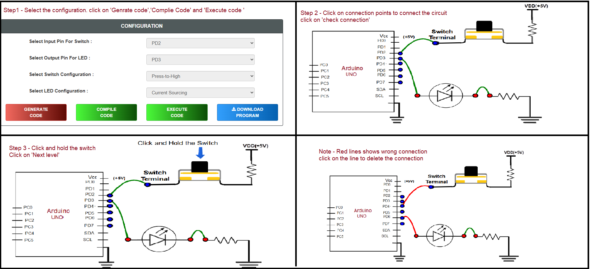

## Procedure

#### Configuration
- Select Input Pin For Switch
- Select Output Pin For LED
- Select Switch Configuration
- Select LED Configuration
- Click on "GENERATE CODE" button to generate code
- Click on "COMPILE" button to compile code
- Click on "EXECUTE" button to execute code and goto mimic
- If you want to download code click on "DOWNLOAD" button
- The MIMIC will open on left side of screen

#### Simulation 
- Connect the Output Pin to the Anode 
- Click on the cathode terminal (red circle) and then click on the resistor terminal (red circle) to connect the cathode with the resistor or vice versa
- Click on the selected input pin terminal (blue circle) and then click on the switch terminal (blue circle) to connect the input pin with the switch terminal or vice versa
- Click on the "Check Connection" button
- If connection is wrong, click on "Reset Connection" button and follow steps 1, 2, 3, and 4 again 
- If connection is successful, click on Switch available on the screen with black color and hold the switch for a few seconds
- While holding the switch, Output LED is on. Observe the square wave graph to see how the output changes until you complete the observation
- Click on "NEXT LEVEL" button go to next stage

#### Questions
- Read all the questions carefully and submit the answer
- After submission, verify the answers 
- Click on result button, "Result" page will displayed

   