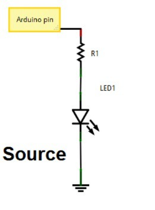
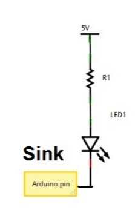

## Theory

The Arduino Uno is a popular open-source microcontroller board that is commonly used in various embedded systems applications due to its ease of use and vast community support. The digital pins of an Arduino are used to connect external devices such as LEDs, switches, sensors, etc. In this experiment, we will be using a push button switch to control an LED connected to a digital pin of the Arduino.

When the push button switch is pressed, the input pin of the Arduino is pulled high. The Arduino's program then detects the change in state of the input pin and toggles the output pin connected to the LED, thereby turning it on. When the push button switch is released, the input pin returns to its initial state, and the Arduino program detects this and turns off the LED.

To implement this functionality, we will use the Arduino programming language, which is based on C/C++. The program will be written to continuously monitor the state of the input pin and toggle the state of the output pin based on the state of the input pin.
Overall, this experiment will demonstrate the fundamental concept of interfacing a push button switch with a microcontroller and controlling an LED's blinking. 
This concept can be further extended to implement various applications such as controlling motors, sensors, and other electronic devices.

Now, for programming the inputs and outputs of the Arduino Uno microcontroller. For setting a pin to input or output, the necessary functions are pinMode(), digitalRead(), and digitalWrite().
Let's consider an example for a digital pin:
pinMode(pin, mode) is used to set the direction of a pin. The mode can be INPUT or OUTPUT. Setting a pin to INPUT will make the corresponding pin an input. Setting a pin to OUTPUT will make the corresponding pin an output.
digitalRead(pin) reads the value of a digital pin, returning HIGH or LOW.
digitalWrite(pin, value) writes a HIGH or LOW value to a digital pin.

#### Current Sourcing (Press to High Configuration)
Current Sourcing is when the Arduino pin pushes current OUT to power the external device. This is often called a "Press to High" configuration when referring to the output pin. When you set the pin to HIGH (5V), the pin acts as the source, sending current OUT to the device (like an LED) which is connected between the pin and Ground (GND). When you set the pin to LOW (0V), the flow of current stops, and the device turns OFF. This is the most common and intuitive way to connect an LED: the Arduino pin provides the power.
  

#### Current Sinking (Press to Low Configuration)
Current Sinking is when the Arduino pin pulls current IN to complete the circuit. In this setup, the device (like an LED) is connected between the main +5V power supply and the Arduino pin. When you want to turn the device ON, you set the pin to LOW (0V). This causes the pin to act as a sink or path to Ground, pulling the current IN from the device, thereby completing the circuit and turning it ON. This is known as a "Press to Low" or "active-low" configuration because the device turns ON when the pin state is LOW.
  

####Components used in simulation: 
- Microcontroller: Arduino Uno 
- Red colour LED 
-  Resistor: 220 Ohms 
- Pushbutton
 

